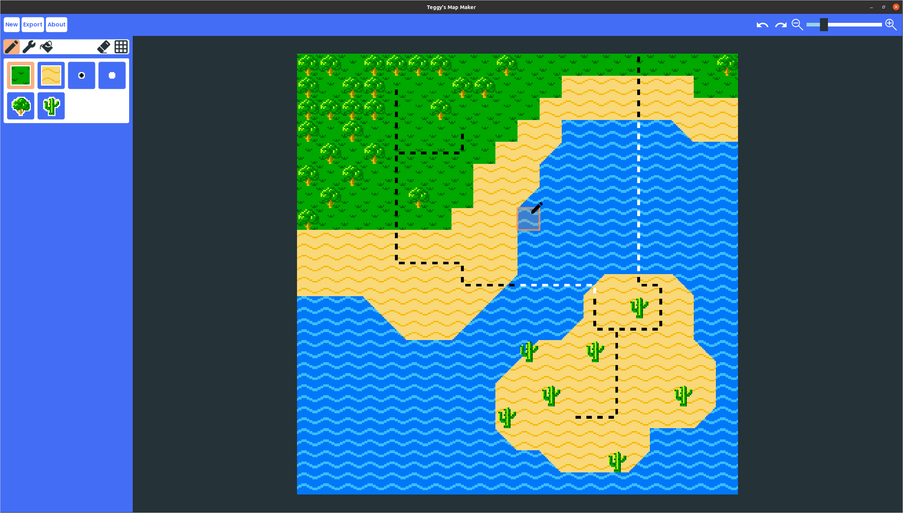

Teggy's Map Maker
=========================

 A tilemap editor built using the Godot Game Engine.

Features
---------------------------

- Create a custom style using a JSON file.
- Load a style to be able to draw a map using the tiles it provides.
- Save the result as a PNG image.

How To Install And Use
-------------------------

Download the zip file from the latest release. This zip file would include an executable, a PCK file, and a folder called 'styles'. The PCK file must be in the same folder that contains the executable for it to work. The 'styles' folder contains some styles that aim to serve as a tutorial on how to create your own.

When you execute the app, it would ask you to select a configuration file. Select one of those provide alongside the executable inside the 'styles' folder or anyone that you have created.

How To Compile
-------------------------

You would need the source code of:
- [Godot v.3.2.2](https://github.com/godotengine/godot/releases/tag/3.2.2-stable)
- [Goost](https://github.com/goostengine/goost)

Then you would need to compile Godot with Goost as a custom module:
- [Compiling Godot](https://docs.godotengine.org/en/stable/development/compiling/index.html)
- [Including a custom module](https://docs.godotengine.org/en/stable/development/cpp/custom_modules_in_cpp.html#compiling-a-module-externally)

Once you have compiled the editor, you can import this project.
